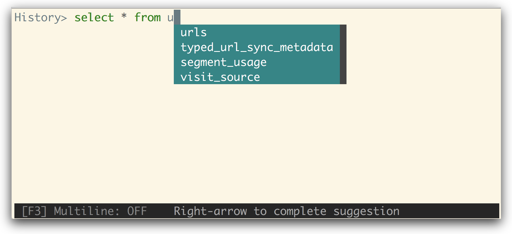
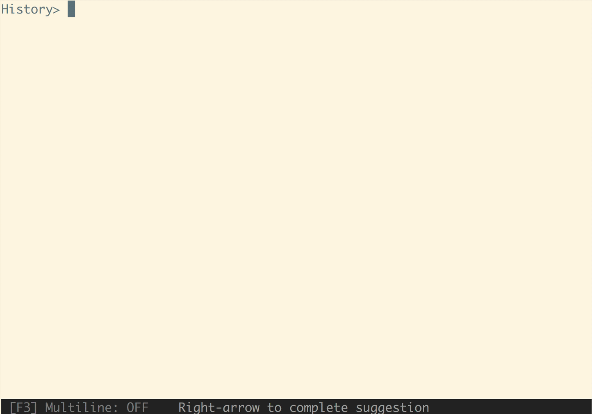

# litecli 1.2.0
```
fix for CSV vtable extension

echo -e 'col_text,col_int\napples,3\noranges,5' > sample.csv

ubuntu@ip-172-31-3-8:~/src/sqlite-csv-vtable$ sudo ../Python_2718_openssl_2k/bin/python2.7 ~/src/litecli-1.2.0/cli mycool.db
Version: 1.2.0
mycool.db> .load ./csv
Time: 0.000s
mycool.db> CREATE VIRTUAL TABLE temp.t1 USING csv(filename="sample.csv", header=YES);
Query OK, 0 rows affected
Time: 0.001s
mycool.db> PRAGMA table_info(t1);
+-----+----------+------+---------+------------+----+
| cid | name     | type | notnull | dflt_value | pk |
+-----+----------+------+---------+------------+----+
| 0   | col_text | TEXT | 0       | <null>     | 0  |
| 1   | col_int  | TEXT | 0       | <null>     | 0  |
+-----+----------+------+---------+------------+----+
2 rows in set
Time: 0.085s
mycool.db> select * from t1;
+----------+---------+
| col_text | col_int |
+----------+---------+
| apples   | 3       |
| oranges  | 5       |
+----------+---------+
2 rows in set
Time: 0.029s
mycool.db>
```


[](https://travis-ci.org/dbcli/litecli)

[Docs](https://litecli.com)

A command-line client for SQLite databases that has auto-completion and syntax highlighting.




## Installation

If you already know how to install python packages, then you can install it via pip:

You might need sudo on linux.

```
$ pip install -U litecli
```

The package is also available on Arch Linux through AUR in two versions: [litecli](https://aur.archlinux.org/packages/litecli/) is based the latest release (git tag) and [litecli-git](https://aur.archlinux.org/packages/litecli-git/) is based on the master branch of the git repo. You can install them manually or with an AUR helper such as `yay`:

```
$ yay -S litecli
```
or

```
$ yay -S litecli-git
```

For MacOS users, you can also use Homebrew to install it:

```
$ brew tap dbcli/tap
$ brew install litecli
```

## Usage

    $ litecli --help
    
    Usage: litecli [OPTIONS] [DATABASE]

    Examples:
      - litecli sqlite_db_name

A config file is automatically created at `~/.config/litecli/config` at first launch. See the file itself for a description of all available options.

## Docs

Visit: [litecli.com/features](https://litecli.com/features)
